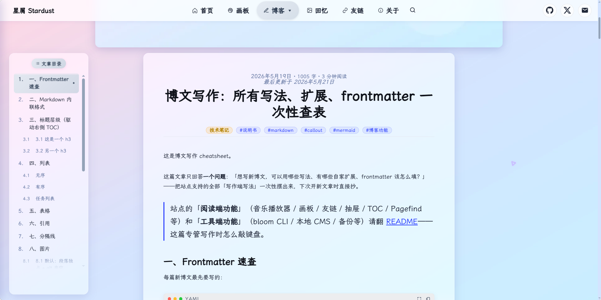
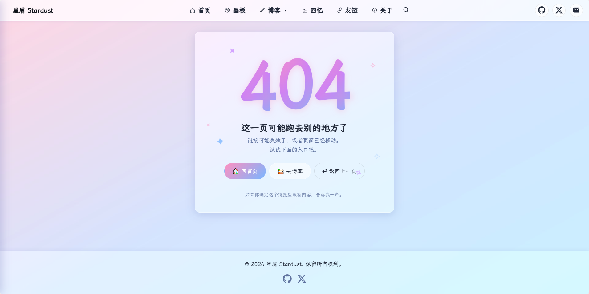
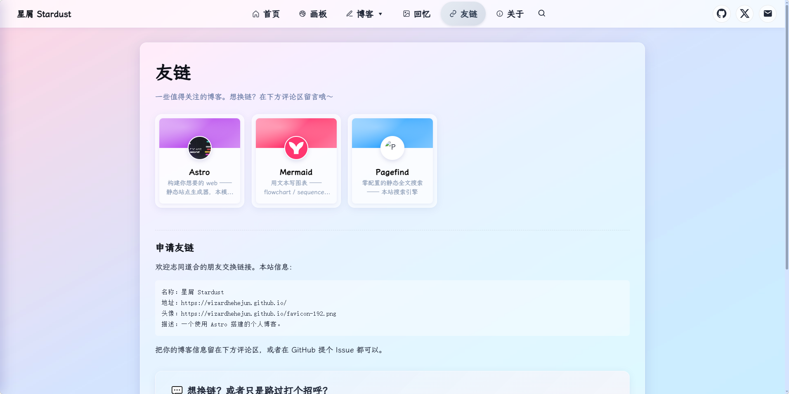
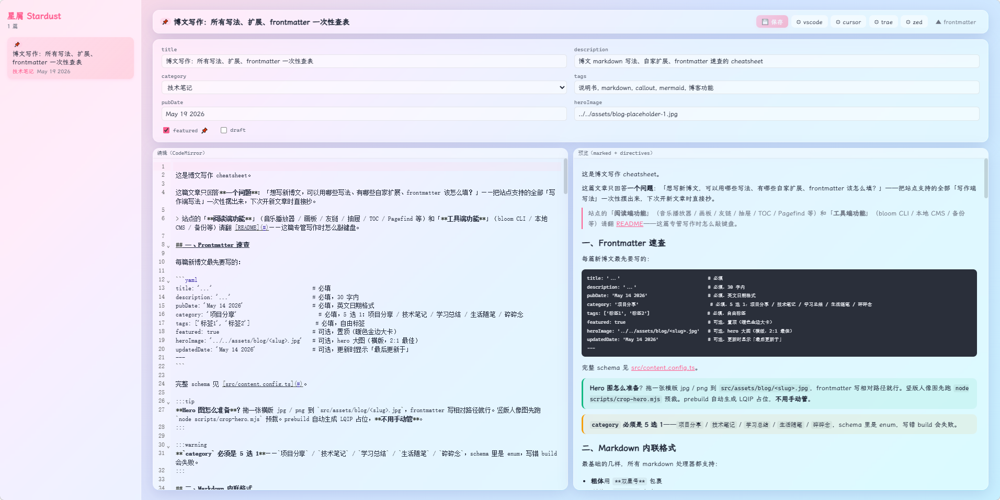
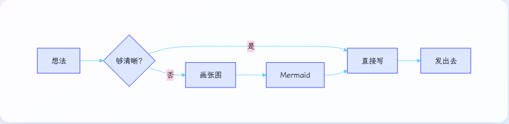
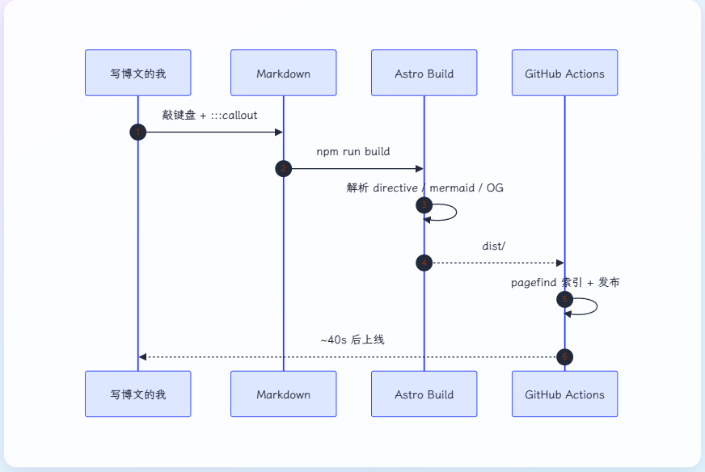

# 星屑 Stardust

> 基于 Astro 6 的博客模板 —— glassmorphism 玻璃风 + 柔和渐变，零后端，推送即发布。

<p align="center">
  
</p>

- 🌐 **在线 demo**：填上你部署的 GitHub Pages 地址（如 `https://<your-username>.github.io/<repo>/`）

---

## ⚙️ 模板初始化清单

这是一个博客模板。把它部署成你自己的博客前，请按下面清单替换：

- [ ] `src/consts.ts` — 填 `SITE_TITLE`、`SITE_DESCRIPTION`，以及 `GISCUS` 的 4 个 ID（从 https://giscus.app 取）
- [ ] `astro.config.mjs` — 把 `site` URL 改成你的域名
- [ ] `package.json` — 更新 `name`、`author`、`repository`
- [ ] `src/assets/avatar.png` — 换成你自己的头像（200×200 PNG），然后跑 `node scripts/gen-favicon.mjs` 重生 favicon
- [ ] `src/assets/bg.jpg` — 换成你自己的背景图（或保留默认的渐变 placeholder）
- [ ] `src/data/friends.json` — 加你的友链（或保持 `[]`）
- [ ] 全局搜索 `href="#"` 占位，把 Header / Footer / Sidebar / about 里的社交链接换成你自己的
- [ ] `src/components/MusicPlayer.astro` — 换成你自己的网易云歌单 ID，或从 `Footer.astro` 删除 `<MusicPlayer />`
- [ ] `.github/workflows/*.yml` — 确认 deploy 目标对应你的仓库
- [ ] 删除或重写 `src/content/blog/blog-features-showcase.md`（默认作为功能演示保留）

> ⚠️ 替换 `src/assets/avatar.png` 后必须跑 `node scripts/gen-favicon.mjs` 重新生成 favicon。每次 `npm run build` **可能要连跑 2-3 次**——前几次可能跳过 CSS 输出（详见 CLAUDE.md「关键陷阱」第 10 条）。验证：`ls dist/_astro/*.css | wc -l` 应该是 7。

---

## 🌸 主要特色

<p align="center">
  
</p>

### 内容能力

- 📝 **Shoka 风 Markdown 扩展** —— `:::info / :::tip / :::warning / :::danger / :::spoiler / :::fold[标题]` 六种 directive，融入玻璃风
- 📊 **Mermaid 客户端 lazy load** —— 含 ` ```mermaid ` 代码块的页面才加载主包，flowchart / sequence / mindmap / quadrant 都支持
- 💻 **代码块 macOS 窗口风** —— shiki 上叠加灰色 header + 红黄绿 3 圆点 + lang 标签 + 放大 / 复制按钮（fullscreen portal 到 body 避开 stacking trap）
- 🖼️ **正文图自动 figure + 智能放大** —— `` 自动转 `<figure>` + figcaption；点击打开仿 macOS 预览的 lightbox（滚轮按光标位置缩放 + 拖拽平移 + 双击 toggle）
- 🔗 **裸 URL 自动转 OG 链接卡** —— 构建时从 `og-cache.json` 读元数据，CI 不上网
- 🔍 **Pagefind 静态全文搜索** —— 浮窗 flex 居中（大屏阶梯加宽 560/640/740px），按 `/` 全局打开
- 💬 **giscus 评论 + 表情反应** —— 基于 GitHub Discussions，自定义玻璃水色主题，博文 / 关于 / 友链三处接入

### 主题视觉

- 🌊 **毛玻璃风** + **滑块式视差背景** —— 独立 `BgLayer` 组件，避开 `backdrop-filter` 冻结 bug
- 🖼️ **Hero 图 LQIP** —— 32px base64 占位（含 dominant color）内联到 HTML，弱网立即可见，全图加载完 0.4s 淡入
- 🃏 **博文卡奇偶交错横向布局** —— 单列横向，奇偶图左 / 图右；置顶用 21:9 全宽大图差异化
- 🎯 **TOC 大改造** —— 玻璃蒙版 + 阅读进度条 + 桌面侧栏 / 移动浮 header 进度环 / 窄屏 FAB
- 🎯 **Header 自动隐藏** —— 下滑藏 / 上滑现 / 贴顶 80px 内永远显示，body class 联动 TOC 等组件
- 🍔 **移动端 ☰ 抽屉** —— 四种关闭路径 + 二级展开 + 嵌入式最近文章 ticker（脉动小圆点 + 无缝循环）
- 💞 **微动效集** —— 头像 hover wiggle / 卡片 wiggle，自动跳过触屏 + reduced-motion
- 💧 **友链卡 per-friend accent** —— 卡顶色块 + 名字色 + hover 发光全部从 `accent` 派生（color-mix 算明暗），20° 3D tilt 跟随鼠标
- 🔤 **霞鹜文楷** —— LXGW WenKai Screen via jsDelivr CDN，按字符 chunk 拆分
- 📜 **自定义滚动条** —— slate-400 `#94a3b8` 灰蓝胶囊滑块（Firefox + Webkit 双适配，hover `#64748b`）
- 📐 **响应式四档断点** —— 640 / 960 / 1280 / 1400（+ 1800 大屏解锁博文列表 1680px）

### 独立页面

- 🏠 **首页** —— hero 打字机 + 头像 wiggle + 橙色 callout 占位（推荐一篇博文 / 项目入口） + 最近文章 3×2 网格 + Now 区
- 🙋 **关于** —— 6 sections 玻璃卡 + giscus 评论
- 🎭 **戏剧版 404** —— `4 0 4` 三联浮动数字 + 飘动星光装饰

<p align="center">
  
</p>
- 👥 **友链** —— per-friend accent + OG 缓存 fallback（thumb-top 卡 / 圆头像 / 字母 tile 三级）

<p align="center">
  
</p>
- 📷 **回忆相册** —— JSON 数据驱动卡片网格，按日期倒序
- 🎨 **画板** —— HTML5 Canvas 自由绘画（6 色板 + 自定义颜色 + 粗细滑块 + 橡皮 + 主题化 confirm modal）
- 📌 **置顶 + 分类 + 标签** —— frontmatter `featured: true` 列表暖色金边大卡；5 个枚举分类 + 自由标签，自动聚合页

### 工作流工具

- 🌸 **`bloom` CLI** —— 自家命令行入口（npm install 后 `npx bloom` 直接用），无参进交互菜单，带子命令直接跑：`bloom new` / `bloom cms` / `bloom refresh-og` / `bloom backup`...
- 📝 **本地浏览器 CMS** —— `bloom cms` 启动，端口 4322，仅 `127.0.0.1` 绑定 + Host 头白名单。三栏布局：文章列表 / frontmatter 表单 + markdown 编辑器 / 实时预览
  <p align="center">
    
  </p>
- 🗃️ **备份 / 还原** —— `bloom backup` / `bloom restore`，tar.gz + 内嵌 manifest，标准（KB 级文本）/ 完整（含图片资产）双模式，路径安全校验防 zip-slip
- 🎵 **音乐播放器** —— APlayer + MetingJS 网易云歌单，固定右下角

---

## 🚀 部署机制

推送到 `main` 分支后：

1. GitHub Actions 触发 `Deploy to GitHub Pages` workflow
2. Ubuntu runner 跑 `npm install` + `npm run build`（含 Pagefind 索引生成）
3. `dist/` 上传为 Pages artifact
4. 自动发布到你的 GitHub Pages 域名（`<your-username>.github.io` 或 `<your-username>.github.io/<repo>`）

约 **40-50 秒**完成，`git push` 即发布。

```powershell
git push                                                       # 推送即触发
gh run list --workflow "Deploy to GitHub Pages" --limit 1      # 查最新状态
```

> 要求 Node ≥ 22.12（CI 也用 Node 22）。

---

## ⚡ 快速开始

### 本地开发

```powershell
git clone <your-repo-url>
cd <your-repo>
npm install
npm run dev      # http://localhost:4321/
```

### 写新博文（三入口）

```powershell
# A. 交互菜单（推荐 —— 可顺手备份 / 还原 / 刷 OG）
npx bloom

# B. 直接新建（菜单的「新建」也走它）
npx bloom new    # 交互输入：标题 / slug / 分类 / 标签 / 置顶 / 描述
                 # 生成 src/content/blog/<slug>.md（含注释掉的 heroImage 行）

# C. 浏览器写作
npx bloom cms    # 端口 4322，首次自动 npm install cms/
```

加 hero 图 → 拖到 `src/assets/blog/<slug>.jpg`，取消 heroImage 注释。
prebuild 自动重生 `lqip.json`，无需手动跑。

发布：

```powershell
git add .
git commit -m "post: 文章标题"
git push         # 约 40-50s 自动上线
```

### Frontmatter 速查

最小字段（schema 见 [src/content.config.ts](src/content.config.ts)）：

```yaml
title: '...'
description: '...'             # 30 字内
pubDate: 'May 14 2026'         # 英文日期格式
category: '项目分享'             # 5 选 1：项目分享/技术笔记/学习总结/生活随笔/碎碎念
tags: ['标签1', '标签2']
featured: true                 # 可选，置顶
heroImage: '../../assets/blog/<slug>.jpg'  # 可选
updatedDate: 'May 14 2026'     # 可选，更新过显示「最后更新于」
```

### Markdown 扩展速查

| 语法 | 用途 |
| :--- | :--- |
| `:::info / :::tip / :::warning / :::danger` | 四色 callout |
| `:::spoiler` | 剧透块（默认隐藏，点击解锁） |
| `:::fold[标题]` | 折叠块（原生 `<details>`） |
| ` ```mermaid ` | 客户端渲染图表（lang 必须是 `mermaid`） |
| `` 独占一段且 alt 非空 | 自动转 `<figure>` + figcaption + lightbox |
| 一行只有一个裸 URL | 自动转 OG 链接卡（数据源 `og-cache.json`） |

#### 📊 Mermaid 图表

客户端 lazy load——不含 ` ```mermaid ` 块的页面零 JS 增量。支持 flowchart / sequenceDiagram / classDiagram / mindmap / gantt / pie 等约 20 种图类。

<p align="center">
  
  <br />
  
</p>

#### 🔗 OG 链接卡

**写法**：博文里**一行只有一个裸 URL**（独占一段），构建时自动转横版玻璃卡——左侧标题/描述/favicon/host，右侧缩略图。

```markdown
看下面这个站点：

https://astro.build/

正文继续……
```

配套命令（CI 不联网，OG meta 必须本地预抓 + commit 进 git）：

```bash
npx bloom refresh-og           # 增量：仅未缓存或抓失败的
npx bloom refresh-og --force   # 全量重抓
```

抓不到的站点会 fallback 为文本卡，不会断渲染。缓存写在 `src/data/og-cache.json`。

<p align="center">
  
</p>

---

## 📦 技术栈

- **[Astro 6](https://astro.build/)** —— 静态站点生成（要求 Node ≥ 22）
- **GitHub Pages** + **GitHub Actions** —— 免费托管，推送即部署
- **Markdown / MDX** —— `.md` 和 `.mdx` 共享同一份 `remarkPlugins`
- **[Pagefind](https://pagefind.app/)** —— 静态全文搜索
- **[giscus](https://giscus.app/)** —— GitHub Discussions 评论 + 表情反应（自定义玻璃主题）
- **[Mermaid](https://mermaid.js.org/)** —— 客户端 lazy load 图表
- **[remark-directive](https://github.com/remarkjs/remark-directive)** + 自家四个 remark 插件（shoka-directives / mermaid / figure / link-card）
- **[APlayer](https://aplayer.js.org/) + [MetingJS](https://github.com/metowolf/MetingJS)** —— 网易云歌单
- **[LXGW WenKai Screen](https://github.com/lxgw/LxgwWenKai-Screen)** —— 中文字体（jsDelivr CDN）
- **[sharp](https://sharp.pixelplumbing.com/)** —— hero 裁剪 + LQIP 生成

---

## 📁 项目结构

```text
stardust/
├── public/                          # 静态资源（直接拷到根路径）
│   ├── favicon-{16,32,192}.png      # 多尺寸浏览器图标
│   ├── apple-touch-icon.png         # iOS 主屏图标
│   ├── giscus-theme.css             # giscus 自定义玻璃主题（生产用）
│   └── memories/                    # 回忆相册图片（拖图进去即可）
├── src/
│   ├── assets/                      # Vite 打包资源（自动 hash）
│   │   ├── bg.jpg                   # 全屏背景图
│   │   ├── avatar.png               # favicon 源图
│   │   └── blog/                    # 博文 hero 图（按 slug 命名）
│   ├── components/                  # 可复用组件（Header / Footer / TOC / 评论 / 音乐...）
│   ├── content/blog/                # ⭐ 写新文章的地方（.md / .mdx）
│   ├── content.config.ts            # 博文 collection schema
│   ├── layouts/BlogPost.astro       # 文章布局 + mermaid / lightbox / 代码块 portal
│   ├── pages/                       # 路由（index / about / 404 / friends / memories / whiteboard / blog / categories / tags）
│   ├── data/
│   │   ├── friends.json             # 友链数据
│   │   ├── og-cache.json            # OG meta 缓存（commit 进 git）
│   │   ├── lqip.json                # LQIP 占位（prebuild 自动重生）
│   │   └── memories.json            # 回忆数据
│   ├── styles/global.css            # 玻璃变量 / 字体 / 共享 keyframes
│   ├── utils/reading-time.ts        # 中文友好字数 + 阅读时长
│   └── consts.ts                    # 站点常量 + giscus 配置
├── plugins/                         # remark 插件
│   ├── remark-shoka-directives.mjs  # :::info/tip/warning/danger/spoiler/fold
│   ├── remark-mermaid.mjs           # mermaid 代码块包装
│   ├── remark-figure.mjs            # 段落图转 figure + figcaption
│   └── remark-link-card.mjs         # 裸 URL 转 OG 链接卡
├── scripts/
│   ├── blog-cli.mjs                 # bloom CLI 入口（菜单 + 子命令分发，bin 注册名 = bloom）
│   ├── new-post.mjs                 # 新建博文 scaffold（bloom new 委托）
│   ├── run-cms.mjs                  # 启动浏览器 CMS（bloom cms 委托）
│   ├── refresh-og.mjs               # 抓友链 + 博文裸 URL OG meta（bloom refresh-og 委托）
│   ├── gen-lqip.mjs                 # LQIP 生成（prebuild 自动跑）
│   ├── gen-favicon.mjs              # favicon 生成（换头像后用）
│   ├── crop-hero.mjs                # 竖图预裁脸居中横版
│   └── lib/backup.mjs               # 备份/还原核心（zip-slip 防护）
├── cms/                             # 本地浏览器 CMS 子项目
├── backups/                         # 本地备份目录（.gitignore）
├── .github/workflows/deploy.yml     # GitHub Actions 部署（Node 22）
├── CLAUDE.md                        # 项目编码规范
└── astro.config.mjs                 # site URL + integrations + shared remarkPlugins
```

---

## 🧰 常用命令

### 标准 Astro / npm（任何 Astro 项目都长这样）

```bash
npm install         # 安装依赖（首次或换电脑后）
npm run dev         # 本地开发 http://localhost:4321/
npm run build       # 生产构建到 dist/（prebuild 自动重生 LQIP）
npm run preview     # 本地预览构建产物
```

### 本项目自定义 CLI（`bloom`）

`npm install` 之后 `npx bloom` 直接可用——bin 链接已自动建立在 `./node_modules/.bin/bloom`。

```bash
npx bloom                       # ⭐ 交互菜单：新建 / CMS / 刷 OG / 备份 / 还原 / 列表 / 清理
npx bloom new                   # 直接新建博文
npx bloom cms                   # 本地浏览器 CMS（端口 4322，仅 127.0.0.1）
npx bloom refresh-og            # 抓 friends.json + 博文裸 URL 的 OG meta
npx bloom refresh-og --force    # 全量重抓
npx bloom backup                # 备份（交互选标准 / 完整）
npx bloom restore               # 从备份还原（默认先备份当前状态）
npx bloom list                  # 列出已有备份
npx bloom clean                 # 清理旧备份
npx bloom --help                # 子命令清单
```

### 资源工具（直接跑脚本，无 bloom 子命令包装）

```bash
node scripts/gen-favicon.mjs    # 换头像后重新生成 favicon
node scripts/crop-hero.mjs      # 竖版人像图预裁为脸居中横版
```

---

## 🗃️ 备份 / 还原

`npx bloom backup` 直接走入（或 `npx bloom` 菜单选「备份」）。两种粒度：

| 模式 | 内容 | 体积 |
| :--- | :--- | :--- |
| **标准** | `src/content/blog` + `src/data` + 几个 config 文件 + CLAUDE.md + package.json | KB 级 |
| **完整** | 标准 + `src/assets/blog` + `bg.jpg` + `avatar.png` + `public/memories` | MB 级 |

实现约束（见 [scripts/lib/backup.mjs](scripts/lib/backup.mjs)）：

- tar.gz 包内嵌 `.backup-manifest-<ts>.json`，还原前可 dry-read
- **还原前必做路径安全校验**：拒绝 `..` / 绝对路径 / null byte（防 zip-slip）
- 默认推荐「先备份当前状态再还原」分支

---

## 🔄 多设备协作

```powershell
# 新机器拉代码
git clone <your-repo-url>
cd <your-repo>
npm install

# 写之前先拉
git pull

# 写完推上去
git push
```

---

## 🎛️ 自定义入口速查

下面是改动频率最高的几处，按「想改什么」反查：

| 想改什么 | 改哪里 |
| :--- | :--- |
| 站点标题 / 描述 | [src/consts.ts](src/consts.ts) |
| giscus 仓库 / 分类 ID | [src/consts.ts](src/consts.ts) 的 `GISCUS` 常量（4 个 ID 从 https://giscus.app 配置器拿） |
| giscus 主题配色 | [public/giscus-theme.css](public/giscus-theme.css)（透明度 / 按钮渐变 / tab 配色） |
| 顶部导航 / 社交链接 | [src/components/Header.astro](src/components/Header.astro) + [src/components/Footer.astro](src/components/Footer.astro) |
| 玻璃透明度 / 边框 / 阴影 | [src/styles/global.css](src/styles/global.css) 的 `:root` `--glass-*` |
| 滚动条颜色 | [src/styles/global.css](src/styles/global.css) 搜 `#94a3b8`（thumb）/ `#64748b`（hover） |
| 选中态色（nav / TOC / 社交 hover） | [src/components/Header.astro](src/components/Header.astro) + [src/components/TableOfContents.astro](src/components/TableOfContents.astro) 搜 `#475569` / `#334155` / `rgba(226, 232, 240` |
| 全屏背景渐变 | [src/styles/global.css](src/styles/global.css) body `background-image` + [src/assets/bg.jpg](src/assets/bg.jpg)（图层主力，删了会透出 CSS 兜底渐变） |
| 头像 wiggle 强度 | [src/styles/global.css](src/styles/global.css) 的 `@keyframes avatar-wiggle` |
| 全屏背景图 | 替换 [src/assets/bg.jpg](src/assets/bg.jpg) |
| favicon | 替换 [src/assets/avatar.png](src/assets/avatar.png) → 跑 `node scripts/gen-favicon.mjs` |
| 音乐歌单 | [src/components/MusicPlayer.astro](src/components/MusicPlayer.astro) 的 `playlistId`（网易云歌单 ID） |
| 友链 | [src/data/friends.json](src/data/friends.json) → 改完跑 `npx bloom refresh-og` |
| 回忆相册 | [src/data/memories.json](src/data/memories.json) + 图片丢 `public/memories/` |
| 画板色板 / 工具 | [src/pages/whiteboard.astro](src/pages/whiteboard.astro) 顶部 `.swatches` HTML 块 |
| 首页 Now 区 | [src/pages/index.astro](src/pages/index.astro) 的 `.now-grid` 块 |
| 首页打字机短句 | [src/pages/index.astro](src/pages/index.astro) 的 `typeLines` 数组 |
| 首页推荐 callout（文案 / 跳转） | [src/pages/index.astro](src/pages/index.astro) 的 `<a class="callout">` 那段 |
| 关于页技术栈 / 项目 | [src/pages/about.astro](src/pages/about.astro) 顶部 `featured` / `stack` |
| Mermaid 主题色 | [src/layouts/BlogPost.astro](src/layouts/BlogPost.astro) 末尾 `mermaid.initialize` |
| 代码块 macOS 窗口配色 | [src/styles/global.css](src/styles/global.css) 的 `pre.astro-code` 段 |
| lightbox 工具栏 / 缩放范围 | [src/layouts/BlogPost.astro](src/layouts/BlogPost.astro) 末尾 figure-lightbox 脚本 |
| Header 自动隐藏阈值 | [src/components/Header.astro](src/components/Header.astro) 的 `TOP_LOCK` / `THRESH` |

---

## 📚 灵感来源

- **[Hexo Shoka](https://shoka.lostyu.me/)** —— `:::callout` / `:::spoiler` / `:::fold` 等 directive 风格
- **[astro-koharu](https://github.com/cosZone/astro-koharu)** —— 项目结构参考

---

## License

代码 **MIT**。文章内容请勿转载。
