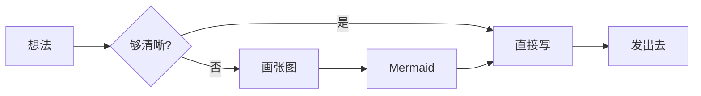
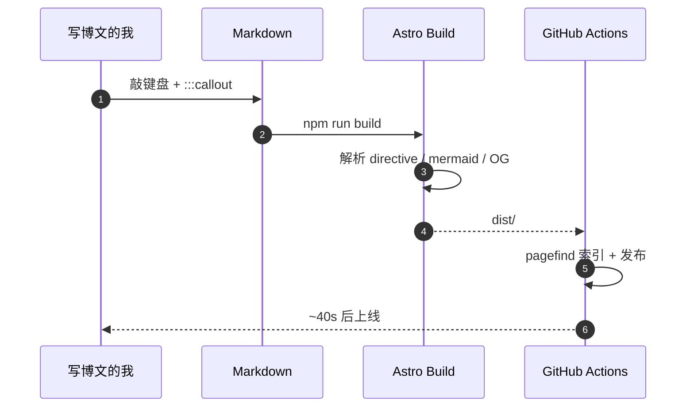

这是博文写作 cheatsheet。

这篇文章只回答**一个问题**：「想写新博文，可以用哪些写法、有哪些自家扩展、frontmatter 该怎么填？」——把站点支持的全部「写作端写法」一次性摆出来，下次开新文章时直接抄。

> 站点的「**阅读端功能**」（音乐播放器 / 画板 / 友链 / 抽屉 / TOC / Pagefind 等）和「**工具端功能**」（bloom CLI / 本地 CMS / 备份等）请翻 [README](#)——这篇专管写作时怎么敲键盘。

## 一、Frontmatter 速查

每篇新博文最先要写的：

```yaml
title: '...'                                # 必填
description: '...'                          # 必填，30 字内
pubDate: 'May 14 2026'                      # 必填，英文日期格式
category: '项目分享'                          # 必填，5 选 1：项目分享 / 技术笔记 / 学习总结 / 生活随笔 / 碎碎念
tags: ['标签1', '标签2']                     # 必填，自由标签
featured: true                              # 可选，置顶（暖色金边大卡）
heroImage: '../../assets/blog/<slug>.jpg'   # 可选，hero 大图（横版，2:1 最佳）
updatedDate: 'May 14 2026'                  # 可选，更新时显示「最后更新于」
---
```

完整 schema 见 [src/content.config.ts](#)。

:::tip
**Hero 图怎么准备**？拖一张横版 jpg / png 到 `src/assets/blog/<slug>.jpg`，frontmatter 写相对路径就行。竖版人像图先跑 `node scripts/crop-hero.mjs` 预裁。prebuild 自动生成 LQIP 占位，**不用手动管**。
:::

:::warning
**`category` 必须是 5 选 1**——`项目分享` / `技术笔记` / `学习总结` / `生活随笔` / `碎碎念`，schema 里是 enum，写错 build 会失败。
:::

## 二、Markdown 内联格式

最基础的几样，所有 markdown 处理器都支持：

- **粗体**用 `**双星号**` 包裹
- *斜体*用 `*单星号*` 包裹
- ~~删除线~~用 `~~双波浪~~`
- `内联代码`用 反引号 包裹
- [带链接的文字](https://wizardhehejun.github.io/) 用 `[文字](url)`
- 上标 H~2~O / 下标 E=mc^2^ —— 需要插件，本站默认渲染器不开启

**组合也可以**：粗体里的 *斜体* 和 `代码片段`，混排没问题。

## 三、标题层级（驱动右侧 TOC）

桌面右侧 TOC 是客户端扫描 `.prose h2, .prose h3` 自动生成的——**只有 h2、h3 进目录**。

### 3.1 这是一个 h3

会在 TOC 里以 `3.1` 缩进显示。

### 3.2 另一个 h3

scroll-spy 高亮当前最贴顶部的项（96px 缓冲带）。

#### 这个 h4 不会进 TOC

正常显示，但不参与目录——适合写「子细节」，不污染导航。

## 四、列表

### 无序

- 第一项
- 第二项
  - 嵌套：缩进 2 个空格
  - 第二个嵌套项
    - 三级嵌套也可以
- 第三项

### 有序

1. 准备种子
2. 翻土播种
3. 日常浇水
4. 等待绽放

### 任务列表

- [x] 写一篇 Mermaid 示例
- [x] 写一篇 cheatsheet
- [ ] 给说明书配一张专属 hero 图
- [ ] 让樱看到这篇

## 五、表格

| 视口        | 名称 | 主要特征                            |
| ----------- | ---- | ----------------------------------- |
| ≤ 640px     | 移动 | 单列堆叠 + drawer 抽屉              |
| 641–960px   | 平板 | sidebar 折顶部横向                  |
| 961–1280px  | 桌面 | 双栏 + 完整 sidebar                 |
| > 1280px    | 大屏 | 解锁更宽内容（最多 1680）           |

表格自动玻璃化，hover 时行底色会轻轻变化。

## 六、引用

> 此后，将有群星闪耀，因为我如今来过。
> 此后，将有百花绽放，因为我从未离去。

多行引用——每一行前面都加 `>`。引用块在玻璃主题里会带一条左侧色条。

## 七、分隔线

用三个或更多 `-` / `*` / `_`：

---

分隔线在玻璃主题里是一条带着渐变的细线，比纯灰色更柔和。

## 八、图片

### 8.1 默认：段落独占 + alt 非空 → 自动 figure + lightbox

只要一段里**只有一张图**且 `alt` 非空，就会自动转成 `<figure>` + 居中 + figcaption。点击图片可以放大（lightbox），支持滚轮缩放、双击 toggle 100% ↔ 250%、缩放后拖拽平移、ESC / × 关闭。


### 8.2 Fallback：保持 inline

如果 `` 的 alt 为空，或同段里有多张图，**保持 inline 渲染**——不会强制转 figure。这是给「行内表情」或「段落里穿插小图标」留的口子。

## 九、代码块

### 9.1 macOS 窗口风外观

每个代码块都会自动加 36px header bar——左侧 3 个圆点（红/黄/绿），中间显示语言，右侧两个按钮：

- **复制** —— 点击有 ✓ 反馈
- **放大** —— portal 到 `document.body` 全屏展示

写法就是标准 markdown 三连反引号 + 语言标识：

````markdown
```javascript
console.log('hi');
```
````

### 9.2 多语言示例

```javascript
// JavaScript: 简单递归
function fibonacci(n) {
  if (n <= 1) return n;
  return fibonacci(n - 1) + fibonacci(n - 2);
}

console.log(fibonacci(10)); // 55
```

```python
# Python: 列表推导式
flowers = ['rose', 'tulip', 'lily']
shouts = [f"Hello, {f}!" for f in flowers if len(f) > 3]
print(shouts)
```

```rust
// Rust: 模式匹配
fn describe(n: i32) -> &'static str {
    match n {
        0 => "zero",
        1..=9 => "single digit",
        _ => "many",
    }
}
```

```css
/* CSS: 站点的玻璃变量 */
:root {
  --glass-bg: rgba(255, 255, 255, 0.55);
  --glass-blur: blur(18px) saturate(180%);
}
```

```bash
# Shell: 部署命令
git add .
git commit -m "post: 新文章标题"
git push
```

主题用 shiki `github-light`，跟玻璃白底契合。

### 9.3 内联无样式块

没有语言标识的代码块，header 中间不显示标签：

````markdown
```
plaintext 内容
```
````

### 9.4 在 markdown 里展示 markdown

外层用 ```` ```` 四个反引号 + `markdown` 标识，里面就可以原样写三连反引号——上面 9.1 / 9.3 的示例就是这么干的。

## 十、Callout 四件套

四种颜色对应四种语气：

:::info
**信息块（蓝色）**——补充说明、背景信息、教程里的「Step-by-step 注意事项」。
:::

:::tip
**建议块（薄荷绿）**——比 info 更亲切，适合写「关键决策」「推荐做法」。
:::

:::warning
**警告块（琥珀色）**——副作用 / 注意条件 / 踩过的坑。技术笔记里的「这里有陷阱」就用它。
:::

:::danger
**危险块（玫红色）**——破坏性操作、不可逆动作、重大坑。比 warning 更严重。
:::

callout 内部可以放**粗体**、列表、`代码`、甚至代码块：

:::tip
推荐的命令：

```bash
npm run build
npm run dev
```

- 先 build 验证
- 再 push
:::

## 十一、Spoiler 剧透块

适合写情感重的话，或者不想被搜索引擎过分抓但又想留下的内容。点击 / hover / 按 Enter / Space 解锁。

:::spoiler
默认隐藏。点击 / hover / 按 Enter 或 Space 解锁。适合写剧透、题外话，或者不想直接显示的内容。
:::

:::warning
Spoiler 里的内容**仍然在 HTML 源码里**——Pagefind 能搜到，搜索引擎也能爬到。不是真隐藏，只是默认收起。真要隐藏的话，用 `data-pagefind-ignore` 包裹元素。
:::

## 十二、Fold 折叠块

用原生 `<details>`——零 JS，点击展开。适合放「题外话」「实现细节」「不打断主线的拓展阅读」。

:::fold[点开看：博文 frontmatter 的 5 个枚举分类]
- 项目分享
- 技术笔记
- 学习总结
- 生活随笔
- 碎碎念

写错任何一个 build 会失败。需要新分类的话先改 [src/content.config.ts](#) 的 enum。
:::

:::fold[点开看：fold 嵌套 fold 也可以]
外层标题在 `:::fold[<这里>]`。

:::fold[里面再套一个]
嵌套层级理论上无限，但**建议最多两层**——再多读者就晕了。
:::
:::

## 十三、链接卡（OG Link Card）

任何独占一段的裸 URL，会自动抓 Open Graph 元数据，渲染成横版玻璃卡——左侧标题/描述/favicon/host，右侧缩略图。

写法就这么简单：

````markdown
看下面这个站点：

https://astro.build/

正文继续……
````

效果：

https://astro.build/

https://github.com/withastro/astro

https://mermaid.js.org/

:::warning
**OG 数据离线抓取**——CI 不联网。新写裸 URL 后必须本地跑一次 `npx bloom refresh-og`，把 `src/data/og-cache.json` 一起 commit。没抓到（或站点没 OG）会降级为 fallback 文本卡，不会断渲染。

```bash
npx bloom refresh-og           # 增量：仅未缓存或失败的
npx bloom refresh-og --force   # 全量重抓
```
:::

## 十四、Mermaid 图表

```` ```mermaid ```` 代码块会被客户端 lazy load 渲染——**不含 mermaid 块的页面零 JS 增量**。



支持的图类约 20 种（flowchart / sequenceDiagram / classDiagram / stateDiagram / erDiagram / gantt / pie / mindmap / quadrantChart / gitGraph 等）。

时序图也能写：



完整语法见 [Mermaid 官方文档](https://mermaid.js.org/intro/)。

## 写在最后

这篇文章本身就是它演示的所有写法的活样本——
从 callout 配色、代码块 macOS 风、Mermaid 渲染、figure lightbox、到链接卡，
你**看到的每一个细节**都可以在源码里翻到对应的 markdown。

下次想用某个写法不记得语法时，回来抄一抄就行。

> 好的内容不需要花哨的语法 ——
> 一段文字、一个 `:::`、一个三连反引号，通常就够了。

这篇 cheatsheet 暂时用着默认 placeholder 的 hero 图。准备好自己的封面后，替换 `src/assets/blog-placeholder-1.jpg`，或者把 frontmatter 的 `heroImage` 指向 `src/assets/blog/` 下你自己的图片。
